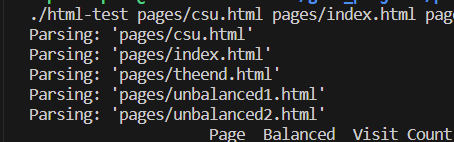
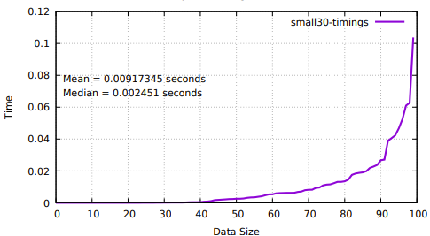
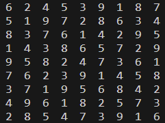
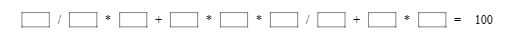

Portfolio
=========

Programming Projects
--------------------

*For access to my private project repositories, please [email me](mailto:ephillips@csustudent.net?subject=GitHub%20Access) with the subject line, GitHub Access.

---
### [HTML Parsing and Crawling | CSCI 315](project1)

---

### [Minimum Overlap Coverage | CSCI 315](project2)

---

### [Sodoku Answer Checker | CSCI 431](project3)

---

### [Sum of Permutations | CSCI 415](project4)

---

Ethics Papers
-------------

### [Notifications and Distractions](/pdf/Ethics Papper CPP1.pdf)

-   **Class: CSCI235 - Procedural Programming**  
-   **Grade: A**

### [THERAC-25 Ethical Dilemma](/pdf/CSCI315_Ethics.pdf)

-   **Class: CSCI315 - Data Structure Analysis** 
-   **Grade: A**

### [Ethical Dilemmas with Work and Faith](/pdf/CSCI315 Ethics Paper.pdf)

-   **Class: CSCI325 - Object-Oriented Programming** 
-   **Grade: A**

---

Presentations
-------------

### [First American Financial Corp](/pdf/security presentation.pdf)

- **Class: CSCI405 - Priciples of Cybersecurity** 
- **Grade: A**

### [Oracle SPARC Solaris](/pdf/Oracle SPARC Solaris.pdf)

- **Class: CSCI431 - Operating Systems** 
- **Grade: A**

---

Page template forked from <a href="https://github.com/csu-cs/csci-portfolio">CSU-CS</a>

<!-- Remove above link if you don't want to attributive -->
