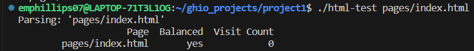
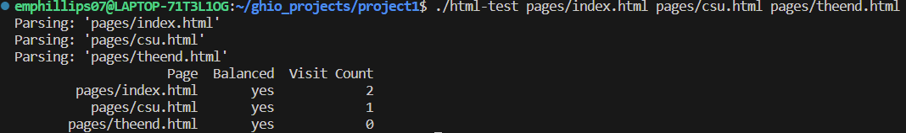
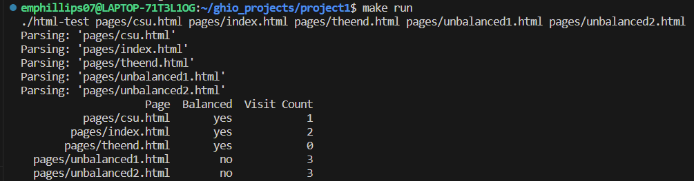

[Back to Portfolio](./)

HTML Parsing and Crawling
===============

-   **Class: CSCI315 - Data Structure Analysis** 
-   **Grade: A** 
-   **Language(s): C++** 
-   **Source Code Repository:** [emphillips07/htmlParsingAndCrawling](https://github.com/emphillips07/htmlParsingAndCrawling)  
    (Please [email me](mailto:ephillips@csustudent.net?subject=GitHub%20Access) to request access.)

## Project description

This project demonstrated the use of stacks in queues in C++. The first part of the project would parse though an HTML document, and verify if the HTML were balanced. Balanced means that every open tag has a close tag, and the last open tag would be closed before any previous open tag was closed. The second part of the project is a basic web crawler. The program would parse though the HTML documents, and check for any anchor tags in the documents. It would then check to see if it was a valid anchor tab. If so, it would visit the other page and the cycle would continue until there were no more pages to visit. It would then print the total number of pages that each of the documents could visit.

## How to compile and run the program

How to compile and run the project.

```bash
cd ./htmlParsingAndCrawling
make
./html-test <page name/s>
```

## UI Design

The program can be ran in two different ways. A single page can be checked if ran with ./html-test and the path to the page (see Fig 1), or multiple pages can be check simultaneously (see Fig 2). If checking all pages is desire, simply run the command make run (see Fig 3). Anyway it is run, it will check the desired pages to see if the HTML tags are balanced, and what pages can visit other with the available selection.

  
Fig 1. Running with only one page.

  
Fig 2. Running with multiple specified pages.

  
Fig 3. Running with all available pages.

For more details see [GitHub Flavored Markdown](https://guides.github.com/features/mastering-markdown/).

[Back to Portfolio](./)
