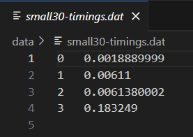

[Back to Portfolio](./)

Minimum Overlap Coverage
===============

-   **Class: CSCI315 - Data Structure Analysis** 
-   **Grade: B** 
-   **Language(s): C++** 
-   **Source Code Repository:** [emphillips07/minimumOverlapCoverage](https://github.com/emphillips07/minimumOverlapCoverage)  
    (Please [email me](mailto:ephillips@csustudent.net?subject=GitHub%20Access) to request access.)

## Project description

This project finds the minimum overlap of sets that cover all points. The example problem that this solves is this: there is a class that has multple group projects that need to be presented. The professor has to grade every student at least once, but wants to minimize the amount of grading that they have to do. The students are able to be members of multiple projects, but only want to present once. This project takes provided sets of students, and finds the minimum amount of sets that need to be presented. The program runs and times the algorithm to see how longs it take it to run.

## How to compile and run the program

How to compile and run the project.

```bash
cd ./minimumOverlapCoverage
make
./min-overlap-test <set file> <yes/no> <list of phrases>
```

## UI Design

The program can be ran with multiple different parameters (see Fig 1). After inputting ./min-overlap-test, the user can put any of the available sets of data that are provided with the project. These sets include: small30.set, small100.set, medium30.set, large30.set, large50.set, and simple.set. Each set provides different set sizes and different set amounts. After choosing a set, the user can input whether or not to save the timing information of how long the algorithm takes to run. Finally, the user inputs the sets that are compared to the given sets. Once all of that has been entered, the program will run and output the covered sets, the minimum number of elements it took to cover those sets, and how longs it took to find that (see Fig 2). If the user opted to store the timing data, it would be stored in a .dat file in the data folder (see Fig 3). The timing data is stored in seconds.

  
Fig 1. The user input in the command line.

  
Fig 2. Output of the program with small30 as the example.

  
Fig 3. The time data file that records how long the alogorithm took.

[Back to Portfolio](./)
