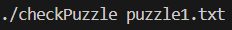
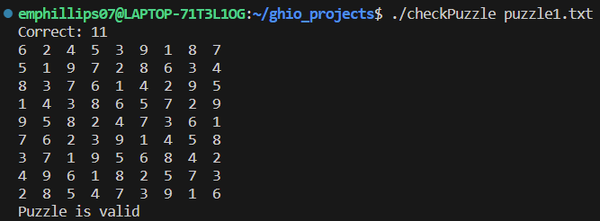
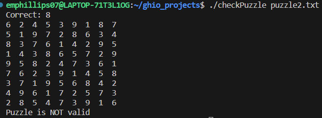

[Back to Portfolio](./)

Sudoku Answer Checker
===============

-   **Class: CSCI431 - Operating Systems** 
-   **Grade: A** 
-   **Language(s): C** 
-   **Source Code Repository:** [emphillips07/sudokuAnswerChecker](https://github.com/emphillips07/sudokuAnswerChecker)  
    (Please [email me](mailto:ephillips@csustudent.net?subject=GitHub%20Access) to request access.)

## Project description

This project consists of a multithreaded application that determines whether or no the solution to a Sudoku puzzle is valid. The program takes a given puzzle from a text file, runs 11 threads to check if different areas are valid, and converges together to determine if the entire puzzle is valid. The parent thread creates the 11 worker threads, passing each of the workers the location that they check in the puzzle. One checks all of the rows, one checks all of the columns, and the rest check each of the 9 squares. Once the worker thread has completed its task, it passes its result back to the parent.

## How to compile and run the program

How to compile and run the project.

```bash
cd ./sudokuAnswerChecker
gcc -pthread -o checkPuzzle main.c
./checkPuzzle <filename.text>
```

## UI Design

This program runs from the command line. To run, enter ./checkPuzzle and then put which file to check (see Fig 1). The project comes with two puzzles: puzzle1.txt and puzzle2.txt. Once a puzzle is picked and the program is run, it will print out the number of correct threads in the puzzle, it will print the puzzle itself, and whether or not the puzzle is valid or not. If the puzzle if valid, it will print out that 11 threads are correct and confirm that the puzzle is valid (see Fig 2). If the puzzle is not valid, the number of correct threads will be less than 11 and confirm that the puzzle is not valid (see Fig 3).

  
Fig 1. User input at the command line.

  
Fig 2. Example output for a puzzle that is valid.

  
Fig 3. Example output for a puzzle that is not valid.

[Back to Portfolio](./)
