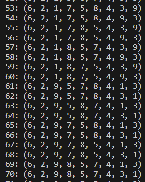
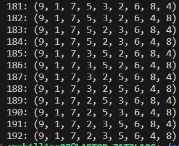

[Back to Portfolio](./)

Sum of Permutations
===============

-   **Class: CSCI415 - Algorithms** 
-   **Grade: A** 
-   **Language(s): C++** 
-   **Source Code Repository:** [emphillips07/sumOfPermutations](https://github.com/emphillips07/sumOfPermutations)  
    (Please [email me](mailto:ephillips@csustudent.net?subject=GitHub%20Access) to request access.)

## Project description

This project demonstrate the use or recursion to find all of the possible answers to a problem. Given numbers 1 though 9, find all of the different set of numbers that statisfy the equation given. While this may seem simple, there is over 360,000 different combinations of how to arrange these numbers. This project demonstrates how to effeciently accomplish this task. There were 192 different combinations to satisfy this equation, and each one are listed out.

## How to compile and run the program

How to compile and run the project.

```bash
cd ./sumOfPermutations
g++ -o main main.cpp
./main
```

## UI Design

The program can be ran only with the given perameters. Once started, the program starts to list out all of the iterations that satisfy the given equation and the current amount of correct combinations (see Fig 1). Once the last of the combinations of numbers are reached, the program is terminated showing that last possible combination of numbers that work for the equation (see Fig 2).

  
Fig 1. Printing out all of the working combinations and current count.

  
Fig 2. All of the permuations have been checked.

[Back to Portfolio](./)
